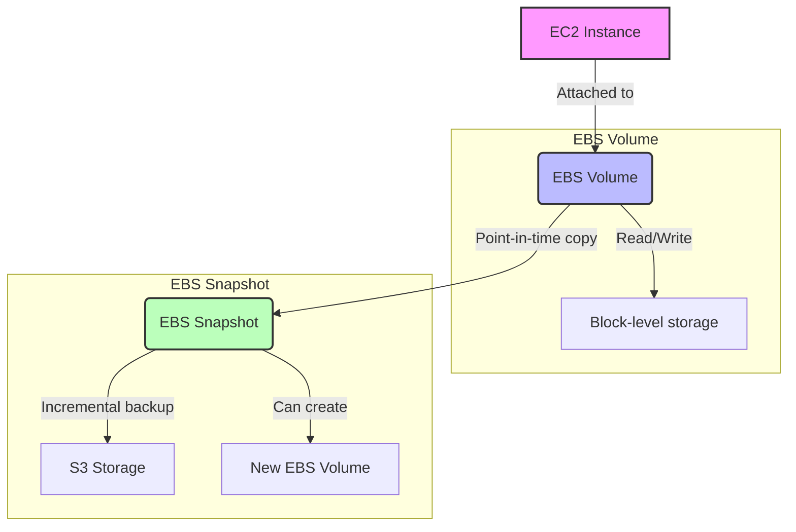
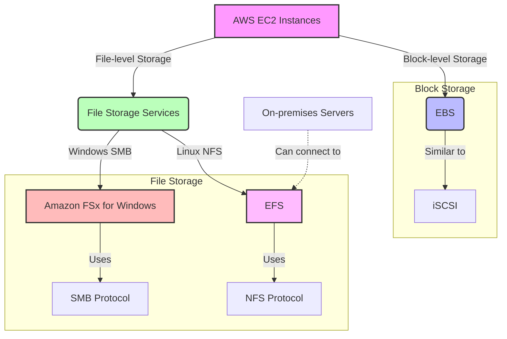
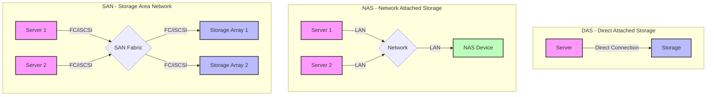
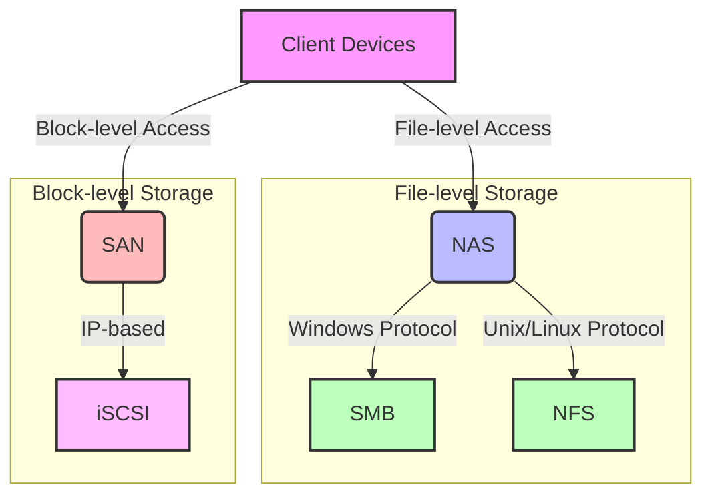

# Storage

* Volumes exist on EBS, whereas Snapshots exist on S3.

1. EC2 Instance: This is a virtual server in the AWS cloud.
2. EBS Volume:
   * Attached to EC2 instances
   * Provides block-level storage
   * Allows read and write operations
3. EBS Snapshot:
   * A point-in-time copy of an EBS volume
   * Stored incrementally in Amazon S3
   * Can be used to create new EBS volumes

The diagram shows that an EC2 instance is attached to an EBS volume, which provides block-level storage for read and write operations. From this EBS volume, you can create an EBS snapshot, which is an incremental backup stored in Amazon S3. These snapshots can then be used to create new EBS volumes if needed.

## Store Options Use Cases

* **S3**: Used for serveless object storage.
* **Glacier**: Used for archiving objects
* **EFS**: Network File System (NFS) for Linux instances. Centralized?? storage solution across multiple AZs
* **FSx for Lustre**: File storage for high performace computing Linux file systems.
* **EBS Volumes**: Persistence storage for EC2 instances
* **Instance Storage**: Ephemoral storage for EC2 instances&#x20;
* **FSx for Windows**: File System for Windows instances. Centralized storage solution across multiple AZs.&#x20;

* EBS (Elastic Block Store):
  * Provides block-level storage volumes for use with EC2 instances
  * Similar to iSCSI in that it offers block-level access
  * Can be thought of as a network-attached virtual hard disk
  * Suitable for databases, file systems, or any applications requiring raw block-level storage
* Amazon FSx:
  * A family of managed file storage services
  * Includes FSx for Windows File Server (uses SMB protocol) and FSx for Lustre
  * FSx for Windows File Server is similar to a NAS using SMB protocol
  * Optimized for specific workloads and applications
* EFS (Elastic File System):
  * A managed NFS file system for use with AWS Cloud services and on-premises resources
  * Similar to a NAS using the NFS protocol
  * Provides a standard file system interface and file system access semantics
  * Suitable for big data and analytics, media processing workflows, content management, web serving, and home directories

## How to encrypt unencrypted volumes

1. Create a snapshot of the unencrypted root device volume.
2. Create a copy of the snapshot and select the encrypt option.
3. Create an AMI from the ecrypted shapshot.
4. Use the AMI to launch new encrypted instances

## Extra

There are three type of Computer Storage:

This diagram illustrates the key differences between DAS, NAS, and SAN storage architectures. Let's break down each one:

1. DAS (Direct Attached Storage):
   * Storage is directly connected to a single server.
   * Simplest form of storage architecture.
   * Not shared between multiple servers.
   * Examples: Internal hard drives, external USB drives.
2. NAS (Network Attached Storage):
   * Storage device is connected to a network (LAN).
   * Multiple servers can access the storage over the network.
   * File-level access (typically uses protocols like NFS or SMB).
   * Easier to set up and manage compared to SAN.
   * Good for file sharing and collaboration.
3. SAN (Storage Area Network):
   * Dedicated high-speed network for storage.
   * Multiple servers connect to the SAN fabric.
   * Block-level access to storage arrays.
   * Uses protocols like Fibre Channel (FC) or iSCSI.
   * Highly scalable and high-performance.
   * Good for databases, virtualization, and high-performance applications.

<figure><figcaption></figcaption></figure>

### NAS, NFS, SMB

1. NAS (Network Attached Storage):
   * A dedicated file storage device that provides shared storage over a network
   * Can support multiple protocols like SMB and NFS
   * Operates at the file level
   * Easy to set up and manage
   * Ideal for file sharing in small to medium-sized networks
2. SMB (Server Message Block):
   * A network file sharing protocol
   * Primarily used in Windows environments
   * Allows computers to share files, printers, and other resources
   * Works at the application layer
   * Also known as CIFS (Common Internet File System) in older versions
3. NFS (Network File System):
   * A distributed file system protocol
   * Commonly used in Unix and Linux environments
   * Allows remote hosts to mount file systems over a network
   * Works at the application layer
   * Provides transparent access to remote files
4. iSCSI (Internet Small Computer Systems Interface):
   * A protocol that allows SCSI commands to be sent over IP networks
   * Provides block-level access to storage devices
   * Appears to the client as a locally attached disk
   * Can be used for SANs (Storage Area Networks)
   * Operates at a lower level than file-sharing protocols like SMB or NFS

Key Differences:

* Level of Operation: NAS, SMB, and NFS operate at the file level, while iSCSI operates at the block level.
* Use Cases: SMB and NFS are used for file sharing, while iSCSI is used for block-level storage access.
* Network Requirements: iSCSI typically requires a dedicated network or VLAN for optimal performance, while NAS, SMB, and NFS can often work on existing LANs.
* Performance: iSCSI generally offers better performance for database and virtualization workloads, while NAS solutions are typically simpler to set up and manage for file sharing.

Now, let's create a diagram to illustrate these concepts and their relationships.

This diagram illustrates the relationships between NAS, SMB, NFS, and iSCSI in the context of network storage. Here's a breakdown of the key components:

1. Client Devices: These represent computers, servers, or other devices that need to access storage.
2. File-level Access:
   * NAS (Network Attached Storage): A storage device that provides file-level access over the network.
   * SMB (Server Message Block): The protocol used primarily in Windows environments for file sharing via NAS.
   * NFS (Network File System): The protocol used primarily in Unix/Linux environments for file sharing via NAS.
3. Block-level Access:
   * SAN (Storage Area Network): A network that provides block-level access to storage.
   * iSCSI: A protocol that allows SCSI commands to be sent over IP networks, used in SANs.

The diagram shows that client devices can access storage in two main ways:

1. File-level access through NAS, which can use either SMB (for Windows) or NFS (for Unix/Linux) protocols.
2. Block-level access through a SAN, which can use the iSCSI protocol.
