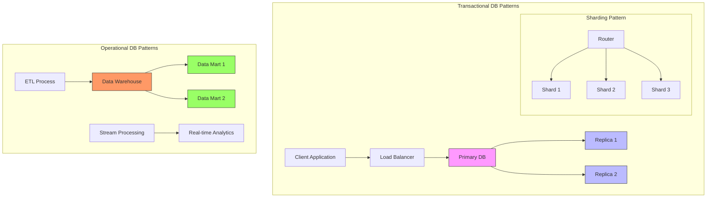
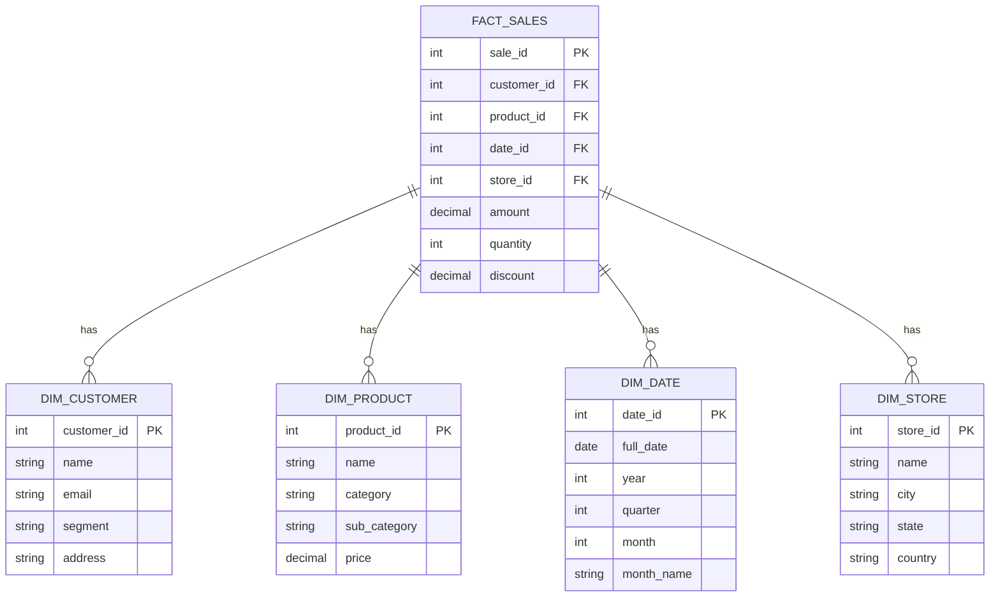

# Transaction VS Operation DBs

Transactional Databases (OLTP - Online Transaction Processing):

1. Primarily handle day-to-day transactions and real-time operations
2. Optimized for fast, small-scale read/write operations
3. Focus on maintaining data consistency and ACID properties (Atomicity, Consistency, Isolation, Durability)
4. Typically use normalized data structures to minimize redundancy
5. Example use cases: banking transactions, order processing, inventory management
6. Usually handle current, in-the-moment data
7. Designed for many concurrent users making small changes

Operational Databases (OLAP - Online Analytical Processing):

1. Designed for business analysis and decision support
2. Optimized for complex queries and large-scale data aggregation
3. Focus on data analysis and reporting rather than transaction processing
4. Often use denormalized data structures for faster querying
5. Example use cases: business intelligence, trend analysis, forecasting
6. Usually contain historical data spanning longer time periods
7. Designed for fewer users running complex queries on large datasets

### Common Architectural patterns

For Transactional Databases:

1. Primary-Replica Pattern
   * Primary node handles writes
   * Multiple read replicas for scaling reads
   * Synchronous or asynchronous replication
2. Sharding Pattern
   * Data distributed across multiple nodes
   * Horizontal partitioning based on key ranges or hash values
   * Each shard handles subset of total data

For Operational Databases:

1. Star Schema
   * Fact tables in the center
   * Dimension tables around the edges
   * Optimized for analytical queries
2. Data Lake Architecture
   * Raw data storage
   * Schema-on-read approach
   * Multiple processing engines
3. Lambda Architecture
   * Batch processing layer
   * Speed layer for real-time processing
   * Serving layer for query results

#### Star Schema Pattern

Here are some official resources about Star Schema:

IBM Documentation: https://www.ibm.com/docs/en/ida/9.1.2?topic=schemas-star-schema

Microsoft Documentation: https://learn.microsoft.com/en-us/power-bi/guidance/star-schema

Let me create a visual representation of a typical star schema:

Key characteristics of Star Schema:

1. Central Fact Table:
   * Contains business metrics (measurements)
   * Foreign keys to all dimension tables
   * Typically numeric and additive
2. Dimension Tables:
   * Contain descriptive attributes
   * Connected to fact table via primary keys
   * Denormalized for query performance
3. Advantages:
   * Simple to understand and navigate
   * Optimized for OLAP queries
   * Efficient for aggregations and joins
4. Common Use Cases:
   * Sales analysis
   * Financial reporting
   * Inventory management
   * Customer behavior analysis

Would you like me to explain any specific aspect of star schema design or show how it compares to other schema types like snowflake schema?

### Resources

Transactional (OLTP) Database Resources:

1. PostgreSQL Official Documentation on High Availability: [https://www.postgresql.org/docs/current/high-availability.html](https://www.postgresql.org/docs/current/high-availability.html)
2. MySQL Documentation on Replication: [https://dev.mysql.com/doc/refman/8.0/en/replication.html](https://dev.mysql.com/doc/refman/8.0/en/replication.html)
3. Microsoft SQL Server Always On Architecture: [https://learn.microsoft.com/en-us/sql/database-engine/availability-groups/windows/always-on-availability-groups-sql-server](https://learn.microsoft.com/en-us/sql/database-engine/availability-groups/windows/always-on-availability-groups-sql-server)

Operational (OLAP) Database Resources:

1. Apache Hadoop Documentation: [https://hadoop.apache.org/docs/stable/](https://hadoop.apache.org/docs/stable/)
2. Snowflake Architecture Guide: [https://docs.snowflake.com/en/user-guide/intro-key-concepts](https://docs.snowflake.com/en/user-guide/intro-key-concepts)
3. Amazon Redshift Architecture: [https://docs.aws.amazon.com/redshift/latest/dg/c\_high\_level\_system\_architecture.html](https://docs.aws.amazon.com/redshift/latest/dg/c_high_level_system_architecture.html)
