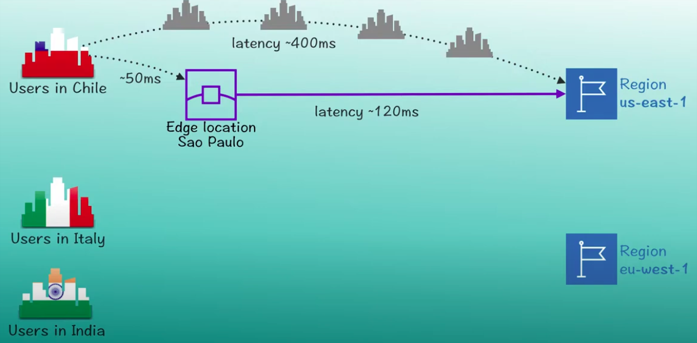

# Kafka

## Resources 

* [Spring Kafka consumer and producers](https://www.confluent.io/blog/apache-kafka-spring-boot-application/?utm_medium=sem&utm_source=google&utm_campaign=ch.sem_br.nonbrand_tp.prs_tgt.kafka_mt.mbm_rgn.emea_lng.eng_dv.all&utm_term=%2Bkafka%20%2Bspring&creative=&device=c&placement=&gclid=Cj0KCQjwhvf6BRCkARIsAGl1GGgOaxBh3AOVOv3o_PcymI6aTI0ewCOgVe47cZmxbGcIMzRA8BL8dFoaAvebEALw_wcB)

## Spring Client with Exactly One Semantic \(EOS\)



In a Spring application we want to guaranty that `read→process-write` sequence is completed exactly once. This can done by configuring the container to start a transaction before invoking the Kafka listeners. If the listener successfully processes the record \(or multiple records, when using a `BatchMessageListener`\), **the container sends the offset\(s\) to the transaction** by using `producer.sendOffsetsToTransaction()`\), before the transaction manager commits the transaction. If the listener throws an exception, the transaction is rolled back and the consumer is repositioned so that the rolled-back record\(s\) can be retrieved on the next poll. 


Spring for Apache Kafka version 2.5

## Topics

Topics should be created to be available and durable. For example, 

```text
replication.factor 3
min.insync.replicas 2
```

Once you're provides a balance between availability and durability. If enforces high replication with strict sync requirements. 

To access kafka broker from docker you can run the following command

```text
docker-compose exec broker bash
kafka-topics --bootstrap-server localhost:9092 --list
```

To execute a KSQL

```text
docker-compose exec ksql-cli ksql http://ksql-server:8088
```

