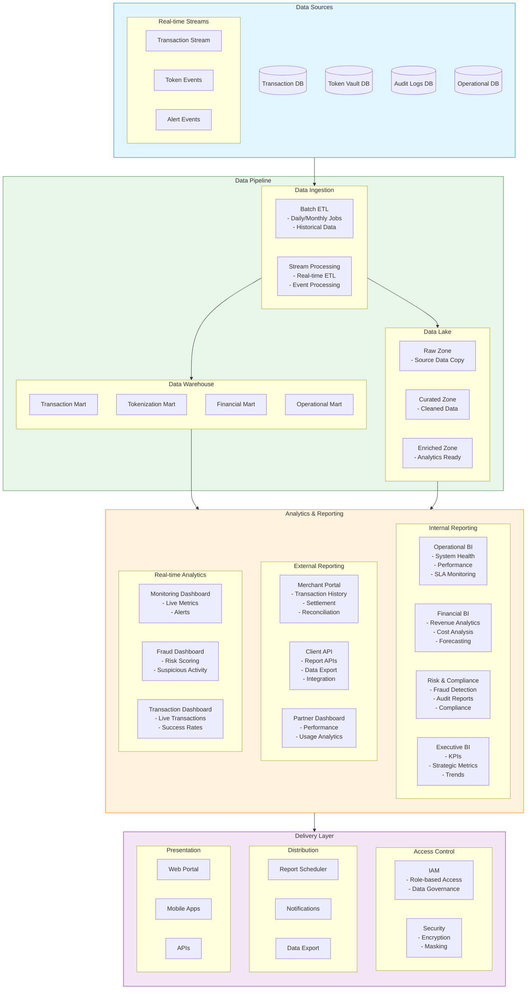

# Data Pipeline

Key components and roles:

1. Data Sources Layer:
   * Transactional Databases
   * Token Vault
   * Audit Logs
   * Operational Metrics
   * Real-time Event Streams
2.  Data Pipeline: A. Data Ingestion

    * Batch ETL for historical data
    * Stream processing for real-time data
    * Data validation and quality checks

    B. Data Warehouse

    * Transaction Mart
    * Tokenization Mart
    * Financial Mart
    * Operational Mart

    C. Data Lake

    * Raw data preservation
    * Data transformation
    * Analytics preparation
3.  Analytics & Reporting: A. Internal Reporting

    * Operational BI
    * Financial Analytics
    * Risk & Compliance
    * Executive Dashboards

    B. External Reporting

    * Merchant Portal
    * Client APIs
    * Partner Dashboards

    C. Real-time Analytics

    * Monitoring Dashboards
    * Fraud Detection
    * Transaction Monitoring
4.  Delivery Layer: A. Access Control

    * Role-based access
    * Data governance
    * Security controls

    B. Distribution

    * Scheduled reports
    * Automated notifications
    * Data export capabilities

    C. Presentation

    * Web portals
    * Mobile applications
    * API endpoints

Key Features:

1. Data Processing:
   * Real-time processing
   * Batch processing
   * Data enrichment
   * Data quality management
2. Security:
   * Data encryption
   * Access controls
   * Audit logging
   * Data masking
3. Customization:
   * Custom reports
   * Configurable dashboards
   * Flexible export options
   * API integration
4. Performance:
   * Caching strategies
   * Query optimization
   * Load balancing
   * Scalability
