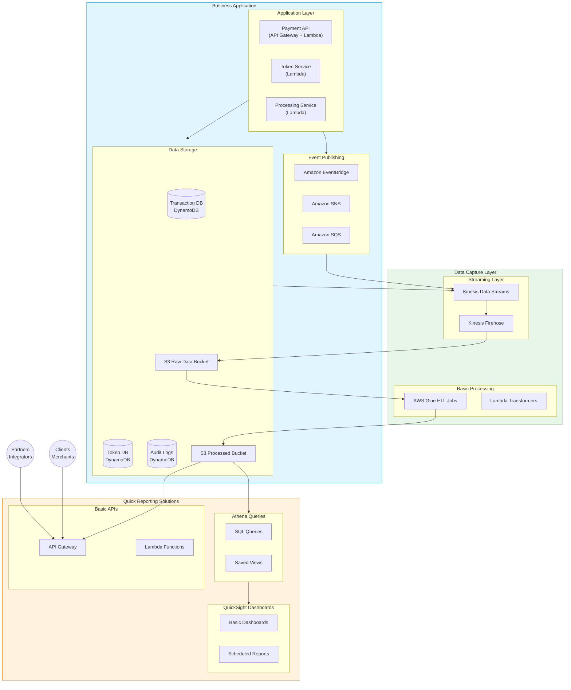

# Page 1

I'll create a diagram showing how to implement a minimal viable reporting solution on AWS, focusing on the business application and data publishing, while deferring the full Analytics & Reporting system implementation.




Let me explain this minimal viable reporting approach:

1.  Business Application:

    A. Application Layer

    * API Gateway + Lambda for APIs
    * Serverless architecture for scalability
    * Event-driven design

    B. Data Storage

    * DynamoDB for transactional data
    * Use DynamoDB Streams for change capture
    * Enable point-in-time recovery

    C. Event Publishing

    * EventBridge for event routing
    * SNS for notifications
    * SQS for decoupling
2.  Data Capture Layer:

    A. Streaming Layer

    * Kinesis Data Streams for real-time data
    * Kinesis Firehose for S3 delivery
    * Configure retry policies

    B. Raw Storage

    * S3 buckets with lifecycle policies
    * Organize by date partitions
    * Enable versioning

    C. Basic Processing

    * AWS Glue for simple ETL
    * Lambda for light transformations
    * Maintain data formats
3.  Quick Reporting Solutions:

    A. Athena Queries

    * Direct SQL access to S3 data
    * Create views for common queries
    * Optimize for cost

    B. QuickSight

    * Basic dashboards
    * Scheduled reports
    * Share with stakeholders

    C. Basic APIs

    * Simple query endpoints
    * Data export APIs
    * Basic authentication

Implementation Steps:

1. Initial Setup:

```
- Create S3 buckets
- Configure Kinesis
- Set up IAM roles
- Enable monitoring
```

2. Data Flow:

```
- Configure DynamoDB streams
- Set up Kinesis Firehose delivery
- Create basic Glue jobs
- Enable Athena
```

3. Basic Reports:

```
- Create Athena tables
- Build QuickSight dashboards
- Implement basic APIs
- Set up monitoring
```

4. Security Controls:

```
- IAM policies
- Encryption at rest
- Encryption in transit
- Access logging
```

Key Benefits:

1. Minimal initial investment
2. Scalable architecture
3. Pay-per-use pricing
4. Easy to extend later

This approach allows you to:

* Start capturing all necessary data
* Provide basic reporting capabilities
* Scale as needed
* Migrate to full analytics later

Would you like me to elaborate on any specific component or provide more implementation details?
