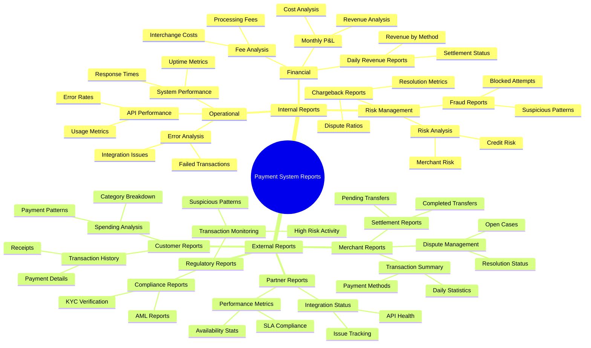

# Reporting

I'll create a diagram showing the different types of reports and their categorization for both internal and external clients.



Let me explain the key aspects of each report category:

1. Internal Reports

Financial Reports:

* Daily Revenue Reports
  * Real-time transaction volumes
  * Revenue by payment method
  * Fee breakdowns
  * Settlement status
* Monthly P\&L
  * Consolidated revenue
  * Operating costs
  * Margin analysis
* Fee Analysis
  * Interchange costs
  * Processing fees
  * Revenue sharing

Risk Management:

* Fraud Detection
  * Suspicious patterns
  * High-risk transactions
  * Blocked attempts
* Risk Exposure
  * Credit risk metrics
  * Merchant risk scoring
  * Market exposure
* Chargeback Tracking
  * Dispute ratios
  * Resolution metrics
  * Root cause analysis

Operational:

* System Performance
  * Uptime metrics
  * Response times
  * Error rates
* Error Analysis
  * Failed transactions
  * Integration issues
  * Resolution times
* API Performance
  * Endpoint usage
  * Response times
  * Error rates

2. External Reports

Merchant Reports:

* Transaction Summary
  * Daily/weekly/monthly volumes
  * Success rates
  * Payment method breakdown
* Settlement Reports
  * Pending settlements
  * Completed transfers
  * Fee breakdowns
* Dispute Management
  * Open cases
  * Resolution status
  * Required actions

Partner Reports:

* Integration Status
  * API health
  * Integration metrics
  * Issue tracking
* SLA Compliance
  * Performance metrics
  * Availability stats
  * Response times

Customer Reports:

* Transaction History
  * Payment details
  * Status tracking
  * Receipts
* Spending Analysis
  * Payment patterns
  * Category breakdown
  * Historical trends

Key Considerations for Implementation:

1. Access Control:

```markdown
- Role-based access control (RBAC)
- Multi-tenant data segregation
- Audit logging of report access
```

2. Delivery Methods:

* Real-time dashboards
* Scheduled email reports
* API access
* Export capabilities (CSV, PDF, Excel)

3. Customization Options:

* Configurable date ranges
* Custom filters
* Saved report templates
* Scheduled deliveries

4. Performance Considerations:

* Pre-aggregated data for common reports
* Caching strategies
* Asynchronous report generation for heavy reports
* Query optimization

Would you like me to elaborate on any specific report type or discuss implementation details for any particular category?
