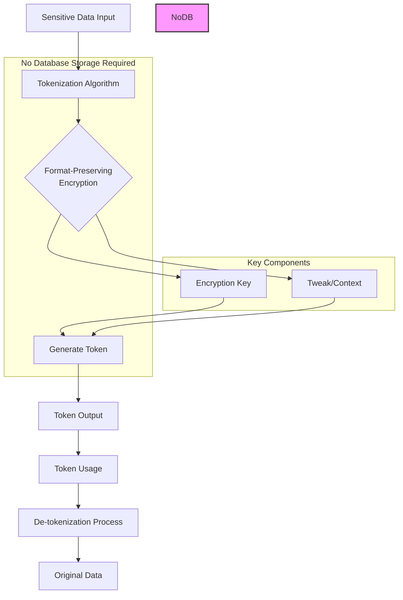

# Vaultless Tokenization

Let me explain Vaultless Tokenization, a modern approach to data security that differs from traditional tokenization methods.

Vaultless Tokenization is a security method that protects sensitive data without storing the original values in a secure database (vault). Here's how it works:

1. Core Concepts:

* Uses algorithmic approaches instead of database lookups
* Preserves data format while securing content
* Generates deterministic tokens (same input always produces same token)

2. Key Components:

* Format-Preserving Encryption (FPE)
* Cryptographic keys
* Tweak values (additional randomization factors)

3. Advantages:

* Reduced infrastructure costs (no vault needed)
* Better performance (no database lookups)
* Improved scalability
* Lower latency
* Simplified disaster recovery

4. Common Applications:

* Credit card number protection
* Social Security numbers
* Personal identifiers
* Banking information

5. Security Features:

* Cryptographically secure algorithms
* Maintains referential integrity
* Compliant with PCI DSS and other standards
* Reversible only with proper keys

6. Comparison to Traditional Tokenization:
   * Traditional:
     * Stores tokens in secure database
     * Requires vault maintenance
     * Higher operational costs
     * Network-dependent
   * Vaultless:
     * No token storage needed
     * Deterministic generation
     * Lower infrastructure requirements
     * Network-independent operation
7. Implementation Considerations:

* Key management is crucial
* Algorithm selection impacts security
* Need for strong encryption standards
* Regular security assessments

Would you like me to elaborate on any particular aspect of vaultless tokenization, such as the specific algorithms used or implementation best practices?
